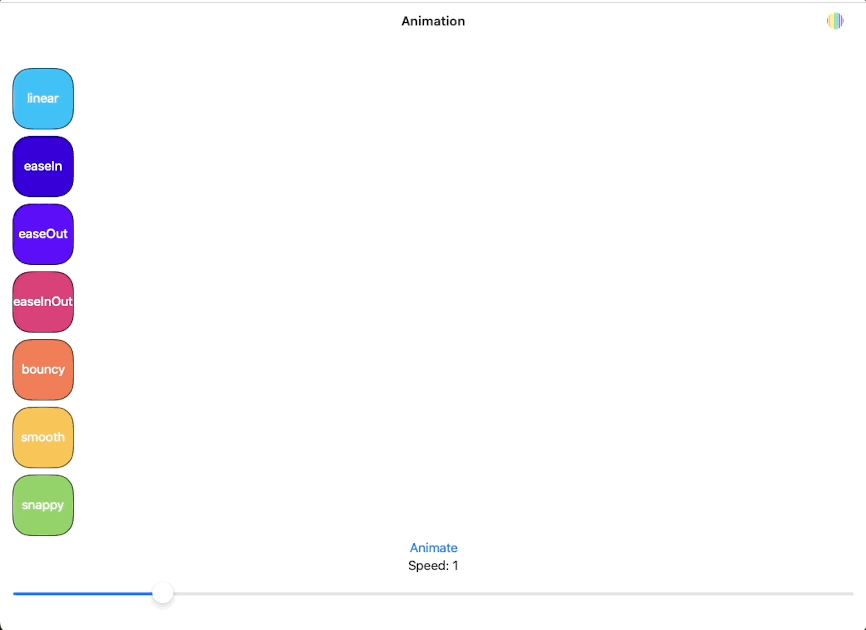

# Animation curves
Project for the 17-Jun-2023 Flock of Swifts meetup showing the new spring based timing curves in iOS 17 using the following new language and SDK features:
* `@Observable` to drive view changes instead of `ObservableObject`
* `@Bindable` to produce bindings to a viewModel property
* The new `Inspector` view
Note that while the new spring based functions actually take longer to complete (the time is the settling time and not the end of the animation)n they appear to be faster since they approach the final state of the animation much faster than any of the legacy cubic curve functions.  In addition they add the velocity from existing animations, which you can see by interrupting the animation repeatedly to add velocity to the bouncy spring.

